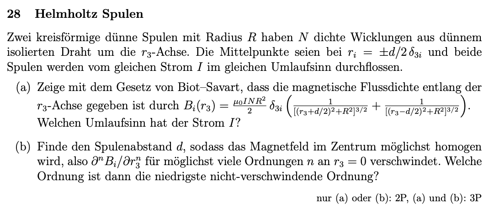
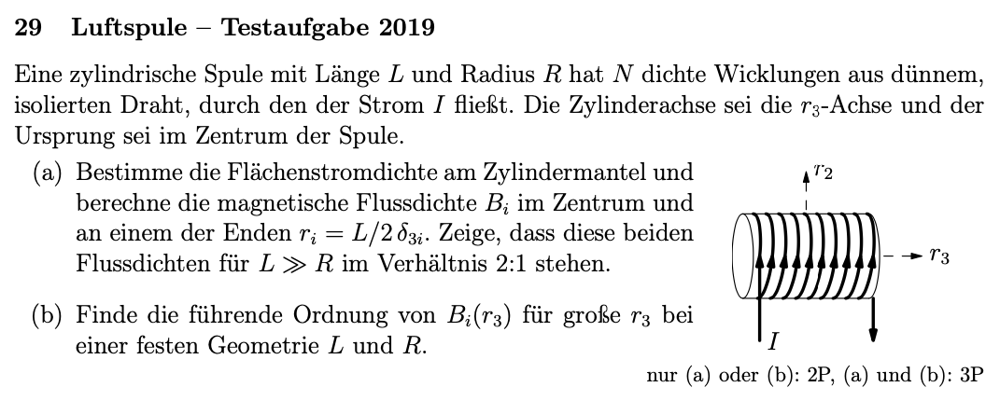
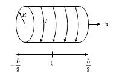
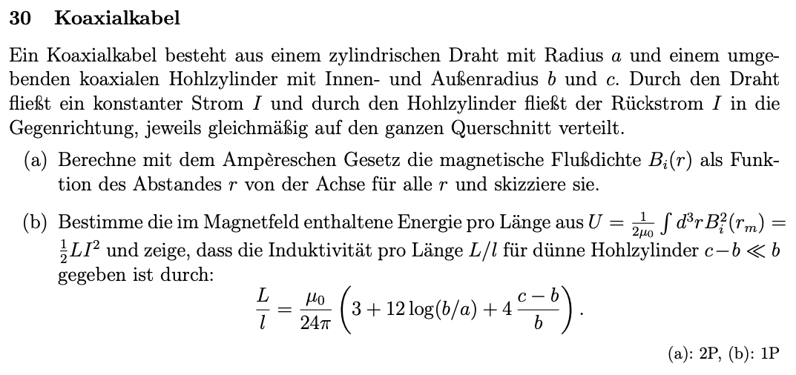
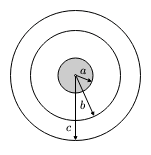
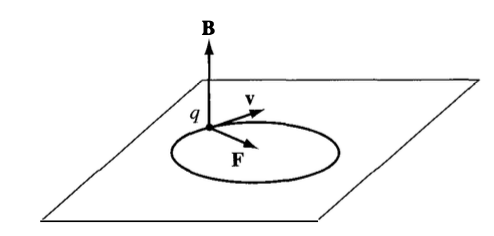
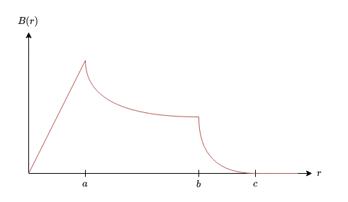

## 10. Problem Set - 08.06.2022
Elektrodynamik I - 136.015

**Gerechnete Beispiele:**
28) 
29) 
30) a)

### 28 Helmholtz Spulen

#### a)

#### b)

### 29 Luftspule - Testaufgabe 2019

#### a)

Die Flächenstromdichte $K$ einer Spule ist gemäß *Electromagnetism* von Gerald L. Pollack und Daniel R. Stump, *Chapter 8 Example 6*, allgemein definiert als:
$$K=\frac{N\cdot I}{L}$$

---

Weiters soll die magentische Flußdichte $\boldsymbol{B}$ an zwei Punkten der Spule ermittelt werden. Allgemein gilt für die den Zusammenhang zwischen der magnetischen Flußdichte $\boldsymbol{B}$ und der magnetischen Feldstärke $\boldsymbol{H}$ gemäß *Electromagnetism* von Gerald L. Pollack und Daniel R. Stump, *Formel 9.26*:
$$\boldsymbol{B}=\mu\cdot\boldsymbol{H}$$
Außerdem ist die magnetische Feldstärke im Zentrum einer Zylinderspule $\boldsymbol{H}_z$ definiert durch: (siehe https://de.wikipedia.org/wiki/Magnetische_Feldst%C3%A4rke)
$$\boldsymbol{H}_z=\boldsymbol{K}=\frac{N\cdot I}{L}\cdot\vec{e}$$
In unserem Fall entspricht die Richtung der magnetischen Feldstärke im Zentrum einer Zylinderspule $\boldsymbol{H}_z$ demnach $r_3$:
$$\boldsymbol{H}=\frac{N\cdot I}{L}\cdot\vec{e}_{r_3}$$
Nachdem im Inneren der Zylinderspule ein Vakuum angenommen werden kann, kann die magentische Permeabilität mit $\mu_0$ angenommen werden. Somit folgt für die magnetische Flußdichte im Zentrum der Zylinderspule $\boldsymbol{B}_z$:
$$\boldsymbol{B}_z=\mu_0\cdot\boldsymbol{H}_z=\mu_0\cdot\frac{N\cdot I}{L}\cdot\vec{e}_{r_3}$$

---

#### b)

### 30 Koaxialkabel

#### a)

Die integrale Form des Ampéreschen Gesetzes lautet gemäß *Electromagnetism* von Gerald L. Pollack und Daniel R. Stump, *Formel 8.42*:
$$\oint_C\boldsymbol{B}\cdot dl=\mu_0\cdot\int_S\boldsymbol{J}\cdot d\boldsymbol{A}=\mu_0\cdot I_{enclosed}$$
Basierend auf diesem Zusammenhang kann in weiterer Folge die magnetische Flußdichte $\boldsymbol{B}$ in allen drei Bereichen ermittelt werden.

---

Als erstes wird die magnetische Flußdichte $\boldsymbol{B}$ im Bereich $r\leq a$ betrachtet. Nachdem der Radius $r$ jeden Wert zwischen $0$ und $a$ annehmen kann, kann nicht davon ausgegangen werden, dass der gesamte Strom $I$ von dem Radius $r$ umschlossen wird. Entsprechend berechnen wir in dem ersten Bereich die magnetische Flußdichte $\boldsymbol{B}$ über die elektrische Stromdichte $\boldsymbol{J}$:
$$\oint_{\partial S}\boldsymbol{B}\cdot dl=\mu_0\cdot\int_S\boldsymbol{J}\cdot d\boldsymbol{A}$$
Das Integral über die magnetische Flußdichte $\boldsymbol{B}$ wird über den Rand $\partial S$ einer eingeschlossenen Fläche $S$ berechnet. In unserem Fall entspricht die eingeschlossene Fläche $S$ einem Kreis mit Radius $r$. Entsprechend ist der Rand $\partial S$ der Umfang des Kreises. Für diesen gilt: $\partial S=2\pi\cdot r$
Das Integral über die elektrische Stromdichte $\boldsymbol{J}$ wird über die Fläche $S$ integriert. Diese entspricht wie bereits festgestellt einem Kreis, wodurch für die Fläche $S$ folgt: $S=r^2\cdot\pi$

Somit kann die magnetische Flußdichte des ersten Bereichs $\boldsymbol{B}_1$ wie folgt berechnet werden:
$$2\pi\cdot \boldsymbol{r}\cdot\boldsymbol{B}_1=\mu_0\cdot\boldsymbol{r}^2\cdot\pi\cdot\boldsymbol{J}$$
Die elektrische Stromdichte $\boldsymbol{J}$ entspricht gemäß ihrer Definition:
$$\boldsymbol{J}=\frac{I}{\boldsymbol{A}}$$
Die Fläche $\boldsymbol{A}$ entspricht dabei der Querschnittsfläche, durch welche gemäß der Angabe der Strom $I$ fließt. Besagte Querschnittsfläche des inneren Drahtes hat den Radius $a$. Somit folgt:
$$\boldsymbol{J}=\frac{I}{\boldsymbol{a}^2\cdot\pi}$$
Dieser Zusammenhang kann nun in die Beziehung zwischen der magnetischen Flußdichte im ersten Bereich $\boldsymbol{B}_1$ eingesetzt werden, wodurch folgt:
$$2\pi\cdot \boldsymbol{r}\cdot\boldsymbol{B}_1=\mu_0\cdot\boldsymbol{r}^2\cdot\cancel{\pi}\cdot\frac{I}{\boldsymbol{a}^2\cdot\cancel{\pi}}$$
Daraus folgt für die magnetische Flußdichte im ersten Bereich $\boldsymbol{B}_1$:
$$\boldsymbol{B}_1(\boldsymbol{r})=\mu_0\cdot\frac{I\cdot\boldsymbol{r}^{\cancel{2}}}{\boldsymbol{a}^2\cdot2\pi\cdot\cancel{\boldsymbol{r}}}=\mu_0\cdot\frac{I\cdot\boldsymbol{r}}{\boldsymbol{a}^2\cdot2\pi}$$

---

Der zweite Bereich wird mit $a\leq r\leq b$ angenommen. Dieser Bereich ist gemäß der Angabe stromfrei. Für den zweiten Bereich gelten die selben geometrischen Annahmen wie bereits im ersten Bereich. In diesem Fall kann jedoch der eingeschlossene Strom $I_{enclosed}$ eindeutig mit $I$ angenommen werden, da sich dieser auch mit einem veränderten Radius $r$ nicht ändert. Das Ampéresche Gesetz kann demnach für den zweiten Bereich wie folgt angeschrieben werden:
$$\oint_{\partial S}\boldsymbol{B}\cdot dl=\mu_0\cdot I_{enclosed}$$
Mit den geometrischen Bestimmungen des ersten Bereichs folgt daraus:
$$2\pi\cdot\boldsymbol{r}\cdot\boldsymbol{B}_2=\mu_0\cdot I_{enclosed}$$
Damit folgt für die magnetische Flußdichte im zweiten Bereich $\boldsymbol{B}_2$:
$$\boldsymbol{B}_2(\boldsymbol{r})=\mu_0\cdot\frac{I}{2\pi\cdot\boldsymbol{r}}$$

---

Für den Bereich $b\leq r\leq c$ gelten weiterhin die Annahmen des ersten Bereiches, wobei das Vorgehen ebenfalls analog zu dem ersten Bereich ist. Nachdem der dritte Bereich ebenfalls von einem Strom $-I$ durchflossen ist, erfolgt die Berechnung der magnetischen Flußdichte im dritten Bereich $\boldsymbol{B}_3$ erneut über die elektrische Stromdichte $\boldsymbol{J}$. Somit folgt für das Ampéresche Gesetz:
$$\oint_{\partial S}\boldsymbol{B}\cdot dl=\mu_0\cdot\int_S\boldsymbol{J}\cdot d\boldsymbol{A}$$
Setzt man erneut die geometrischen Zusammenhänge des ersten Bereiches ein, folgt daraus:
$$2\pi\cdot \boldsymbol{r}\cdot\boldsymbol{B}_{3_{self}}=\mu_0\cdot\boldsymbol{r}^2\cdot\pi\cdot\boldsymbol{J}$$
Die elektrische Stromdichte $\boldsymbol{J}$ entspricht gemäß ihrer Definition:
$$\boldsymbol{J}=\frac{I}{\boldsymbol{A}}$$
Die gesamte Querschnittsfläche $\boldsymbol{A}$ des dritten Bereiches entspricht dabei:
$$\boldsymbol{A}=\boldsymbol{c}^2\cdot\pi-\boldsymbol{b}^2\cdot\pi=\pi\cdot(\boldsymbol{c}^2-\boldsymbol{b}^2)$$
Der Strom $I$ entspricht im dritten Bereich, gemäß der Angabe:
$$I=-I$$
Somit folgt für die elektrische Stromdichte $\boldsymbol{J}$ im dritten Bereich:
$$\boldsymbol{J}=-\frac{I}{\pi\cdot(\boldsymbol{c}^2-\boldsymbol{b}^2)}$$
Eingesetzt in den Zusammenhang zwischen der magnetischen Flußdichte im dritten Bereich $\boldsymbol{B}_{3_{self}}$ und der elektrischen Stromdichte $\boldsymbol{J}$ ergibt sich damit: (Der Bereich $\boldsymbol{r}^2\cdot\pi-\boldsymbol{b}^2\cdot\pi=(\boldsymbol{r}^2-\boldsymbol{b}^2)\cdot\pi$ entspricht der Fläche, durch welche die elektrische Stromdichte $\boldsymbol{J}$ bei einem Radius $\boldsymbol{r}$ geht.)
$$2\pi\cdot \boldsymbol{r}\cdot\boldsymbol{B}_{3_{self}}=\mu_0\cdot(\boldsymbol{r}^2-\boldsymbol{b}^2)\cdot\pi\cdot\left(-\frac{I}{\pi\cdot(\boldsymbol{c}^2-\boldsymbol{b}^2)}\right)$$
Die magnetische Flußdichte im dritten Bereich $\boldsymbol{B}_3$ folgt damit zu:
$$\boldsymbol{B}_{3_{self}}=\mu_0\cdot\frac{(\boldsymbol{r}^2-\boldsymbol{b}^2)\cdot\cancel{\pi}}{2\pi\cdot\boldsymbol{r}}\cdot\left(-\frac{I}{\cancel{\pi}\cdot(\boldsymbol{c}^2-\boldsymbol{b}^2)}\right)=-\mu_0\cdot\frac{I}{2\pi\cdot\boldsymbol{r}}\cdot\frac{\boldsymbol{r}^2-\boldsymbol{b}^2}{\boldsymbol{c}^2-\boldsymbol{b}^2}$$Weiters muss in dem dritten Bereich die magnetische Flußdichte des zweiten Bereiches $\boldsymbol{B}_2$ ebenfalls berücksichtigt werden, nachdem diese in dem dritten Bereich ebenfalls wirkt. Somit ergibt sich für die finale Ermittelung der magnetischen Flußdichte im dritten Bereich $\boldsymbol{B}_3$:
$$\boldsymbol{B}_3=\boldsymbol{B}_2+\boldsymbol{B}_{3_{self}}$$
Mit den Ergebnissen für $\boldsymbol{B}_2$ und $\boldsymbol{B}_{3_{self}}$ folgt für $\boldsymbol{B}_3$ final:
$$\boldsymbol{B}_3=\mu_0\cdot\frac{I}{2\pi\cdot\boldsymbol{r}}-\mu_0\cdot\frac{I}{2\pi\cdot\boldsymbol{r}}\cdot\frac{\boldsymbol{r}^2-\boldsymbol{b}^2}{\boldsymbol{c}^2-\boldsymbol{b}^2}$$
$$\boldsymbol{B}_3(\boldsymbol{r})=\mu\cdot\frac{I}{2\pi\cdot\boldsymbol{r}}\cdot\left(1-\frac{\boldsymbol{r}^2-\boldsymbol{b}^2}{\boldsymbol{c}^2-\boldsymbol{b}^2}\right)$$
---

Im vierten Bereich, für $\boldsymbol{c}\leq\boldsymbol{r}$, entspricht die magnetische Flußdichte $\boldsymbol{B}_4$ gleich $0$:
$$\boldsymbol{B}_4(\boldsymbol{r})=\boldsymbol{B}_3(\boldsymbol{c})=\mu\cdot\frac{I}{2\pi\cdot\boldsymbol{r}}\cdot\left(1-\frac{\boldsymbol{r}^2-\boldsymbol{b}^2}{\boldsymbol{c}^2-\boldsymbol{b}^2}\right)=\mu\cdot\frac{I}{2\pi\cdot\boldsymbol{r}}\cdot\Biggl(1-\underbrace{\frac{\boldsymbol{c}^2-\boldsymbol{b}^2}{\boldsymbol{c}^2-\boldsymbol{b}^2}}_{=1}\Biggl)$$
$$\boldsymbol{B}_4(\boldsymbol{r})=\mu\cdot\frac{I}{2\pi\cdot\boldsymbol{r}}\cdot\underbrace{(1-1)}_{=0}=0$$

---

Die Ausbreitungsrichtung aller magnetischer Flußdichten $\boldsymbol{B}_1$, $\boldsymbol{B}_2$, $\boldsymbol{B}_3$ und $\boldsymbol{B}_4$ ist jeweils $\vec{e}_{\varphi}$:
$$\boldsymbol{B}_1(\boldsymbol{r})=\mu_0\cdot\frac{I\cdot r}{a^2\cdot2\pi}\cdot\vec{e}_{\varphi}$$
$$\boldsymbol{B}_2(\boldsymbol{r})=\mu_0\cdot\frac{I}{2\pi\cdot r}\cdot\vec{e}_{\varphi}$$
$$\boldsymbol{B}_3(\boldsymbol{r})=\mu\cdot\frac{I}{2\pi\cdot r}\cdot\left(1-\frac{r^2-b^2}{c^2-b^2}\right)\cdot\vec{e}_{\varphi}$$
$$\boldsymbol{B}_4(\boldsymbol{r})=0$$

---

Skizziert entspricht die magnetische Flußdichte $\boldsymbol{B}$ des Koaxialkabels abhängig von dem Radius $\boldsymbol{r}$:

#### b)
