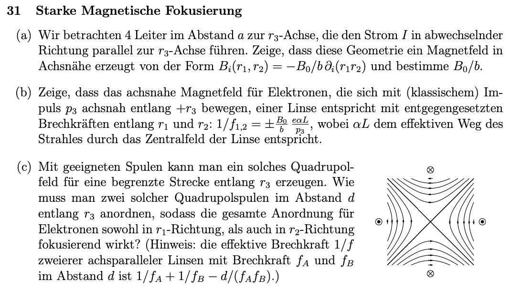
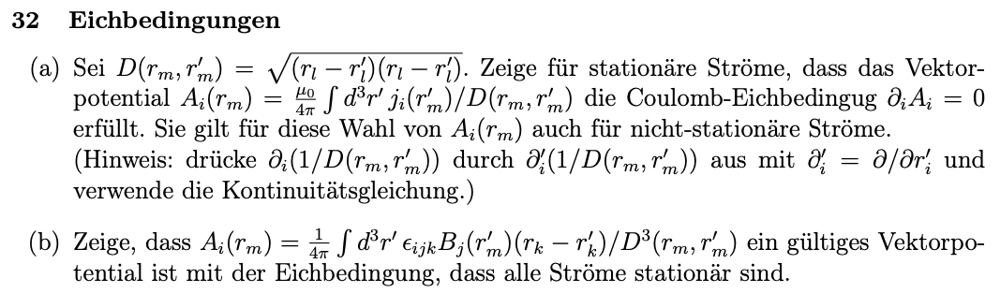
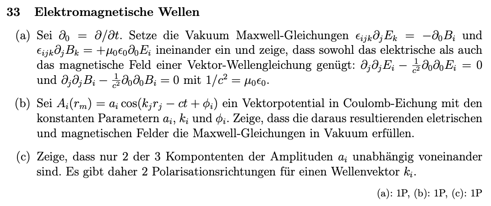

## 11. Problem Set - 15.06.2022
Elektrodynamik I - 136.015

**Gerechnete Beispiele:**
31) 
32) 
33) a)

### 31 Starke Magnetische Fokusierung

#### und  a)

#### b)

#### c)

### 32 Eichbedingungen

#### a)

#### b)

### 33 Elektromagnetische Wellen

#### a)
Gemäß der Angabe sollen die zwei Maxwell-Gleichungen im Vakuum ineinander eingesetzt werden. Diese lauten:
$$\epsilon_{ijk}\partial_jE_k=-\partial_0B_i\rightarrow\boldsymbol{\nabla}\times\boldsymbol{E}=-\frac{\partial\boldsymbol{B}}{\partial_t}$$
und
$$\epsilon_{ijk}\partial_jB_k=\mu_0\epsilon_0\partial_0E_i\rightarrow\boldsymbol{\nabla}\times\boldsymbol{B}=\mu_0\epsilon_0\frac{\partial\boldsymbol{E}}{\partial_t}$$

---

Begonnen mit der ersten Maxwell-Gleichung im Vakuum, kann diese wie folgt angeschrieben werden:
$$\boldsymbol{\nabla}\times\boldsymbol{E}=-\frac{\partial\boldsymbol{B}}{\partial_t}$$
Um die zweite Maxwell-Gleichung im Vakuum in die erste Maxwell-Gleichung im Vakuum einsetzen zu können, wird der Zusammenhang um $\boldsymbol{\nabla}\times$ erweitert. Damit folgt:
$$\boldsymbol{\nabla}\times\left(\boldsymbol{\nabla}\times\boldsymbol{E}\right)=-\left(\boldsymbol{\nabla}\times\frac{\partial\boldsymbol{B}}{\partial_t}\right)$$
Die rechte Seite der Gleichung kann weiters umgeschrieben werden zu:
$$\boldsymbol{\nabla}\times\left(\boldsymbol{\nabla}\times\boldsymbol{E}\right)=-\frac{\partial}{\partial_t}(\underbrace{\boldsymbol{\nabla}\times\boldsymbol{B}}_{\text{2. MG}})$$
Dadurch kann in den Term auf der rechten Seite die zweite Maxwell-Gleichung im Vakuum eingesetzt werden:
$$\boldsymbol{\nabla}\times\left(\boldsymbol{\nabla}\times\boldsymbol{E}\right)=-\frac{\partial}{\partial_t}\left(\mu_0\epsilon_0\frac{\partial\boldsymbol{E}}{\partial_t}\right)$$
Zusammengefasst ergibt sich somit:
$$\boldsymbol{\nabla}\times\left(\boldsymbol{\nabla}\times\boldsymbol{E}\right)=-\mu_0\epsilon_0\frac{\partial^2\boldsymbol{E}}{\partial_t^2}$$
Die linke Seite der Gleichung kann gemäß den Rechenregeln für den Rotationsoperator umgeformt werden. Diese besagen unter anderem, dass gilt (siehe u.a. *Electromagnetism* von Gerald L. Pollack und Daniel R. Stump, *Formel 8.59*)
$$\boldsymbol{\nabla}\times\left(\boldsymbol{\nabla}\times\boldsymbol{E}\right)=\text{grad div }\vec{E}-\text{div grad }\vec{E}=\text{grad div }\vec{E}-\Delta\vec{E}=\boldsymbol{\nabla}(\boldsymbol{\nabla}\cdot\boldsymbol{E})-\boldsymbol{\nabla}^2\boldsymbol{E}$$
*(Der Gradient eines Skalars entspricht $\text{grad }g=(\boldsymbol{\nabla}g)_i$. Die Divergenz eines Vektorfeldes entspricht $\text{div }\boldsymbol{F}=\boldsymbol{\nabla}\cdot\boldsymbol{F}$.)*

Mit diesem Zusammenhang folgt für die Gleichung:
$$\boldsymbol{\nabla}(\boldsymbol{\nabla}\cdot\boldsymbol{E})-\boldsymbol{\nabla}^2\boldsymbol{E}=-\mu_0\epsilon_0\frac{\partial^2\boldsymbol{E}}{\partial_t^2}$$
Für die Divergenz des elektrischen Feldes $\boldsymbol{\nabla}\cdot\boldsymbol{E}$ gilt gemäß der ersten elektrostatischen Maxwell-Gleichung:
$$\boldsymbol{\nabla}\cdot\boldsymbol{E}=\frac{\rho}{\epsilon_0}$$
Nachdem in diesem Fall das elektrische Feld in einem Vakuum betrachtet wird, ist die Ladungsdichte $\rho$ gleich $0$. Somit folgt:
$$\boldsymbol{\nabla}(\underbrace{\boldsymbol{\nabla}\cdot\boldsymbol{E}}_{=0})-\boldsymbol{\nabla}^2\boldsymbol{E}=-\mu_0\epsilon_0\frac{\partial^2\boldsymbol{E}}{\partial_t^2}$$
Nachdem der Gradient von Null $\nabla(0)$ ebenfalls Null entspricht, folgt:
$$\underbrace{\boldsymbol{\nabla}(0)}_{=0}-\boldsymbol{\nabla}^2\boldsymbol{E}=-\mu_0\epsilon_0\frac{\partial^2\boldsymbol{E}}{\partial_t^2}$$
$$-\boldsymbol{\nabla}^2\boldsymbol{E}=-\mu_0\epsilon_0\frac{\partial^2\boldsymbol{E}}{\partial_t^2}$$
Umgeformt ergibt sich somit:
$$0=\boldsymbol{\nabla}^2\boldsymbol{E}-\mu_0\epsilon_0\frac{\partial^2\boldsymbol{E}}{\partial_t^2}$$
Setzt man nun für den Laplace-Operator $\boldsymbol{\nabla}^2$ den Ausdruck $\partial_j\partial_j$ ein, für das Produkt aus der Permittivität und der magnetischen Permeabilität $\mu_0\epsilon_0$ den Ausdruck $\frac{1}{c^2}$, wobei $c$ für die Lichtgeschwindigkeit steht, und für $\frac{\partial}{\partial_t}$ den in der Angabe beschrieben Ausdruck $\partial_0$, folgt die Vektor-Wellengleichung für das elektrische Feld:
$$0=\partial_j\partial_j\boldsymbol{E}-\frac{1}{c^2}\partial_0\partial_0\boldsymbol{E}$$

---

Analog zu der vorangehenden Berechnung basierend auf der ersten Maxwell-Gleichung im Vakuum, kann die Berechnung auf der zweiten Maxwell-Gleichung im Vakuum basieren. Diese lautet:
$$\boldsymbol{\nabla}\times\boldsymbol{B}=\mu_0\epsilon_0\frac{\partial\boldsymbol{E}}{\partial_t}$$
Wir erweitern den Zusammenhang erneut um ein Kreuzprodukt mit $\boldsymbol{\nabla}$, wodurch folgt:
$$\boldsymbol{\nabla}\times\left(\boldsymbol{\nabla}\times\boldsymbol{B}\right)=\boldsymbol{\nabla}\times\left(\mu_0\epsilon_0\frac{\partial\boldsymbol{E}}{\partial_t}\right)$$
Wie bereits in der ersten Berechnung kann auch hier der rechte Ausdruck umgeschrieben werden zu:
$$\boldsymbol{\nabla}\times\left(\boldsymbol{\nabla}\times\boldsymbol{B}\right)=\mu_0\epsilon_0\frac{\partial}{\partial_t}\left(\boldsymbol{\nabla}\times\boldsymbol{E}\right)$$
Für $\boldsymbol{\nabla}\times\boldsymbol{E}$ kann die erste Maxwell-Gleichung im Vakuum eingesetzt werden. Dadurch ergibt sich:
$$\boldsymbol{\nabla}\times\left(\boldsymbol{\nabla}\times\boldsymbol{B}\right)=\mu_0\epsilon_0\frac{\partial}{\partial_t}\left(-\frac{\partial\boldsymbol{B}}{\partial_t}\right)$$
Zusammengefasst entspricht dieser Ausdruck:
$$\boldsymbol{\nabla}\times\left(\boldsymbol{\nabla}\times\boldsymbol{B}\right)=-\mu_0\epsilon_0\frac{\partial^2\boldsymbol{B}}{\partial_t^2}$$
Für die linke Seite kann erneut die Rechenregel des Rotationsoperators angewandt werden (siehe die Berechnung basierend auf der ersten Maxwell-Gleichung im Vakuum; siehe *Electromagnetism* von Gerald L. Pollack und Daniel R. Stump, *Formel 8.59*), wodurch folgt:
$$\boldsymbol{\nabla}(\boldsymbol{\nabla}\cdot\boldsymbol{B})-\boldsymbol{\nabla}^2\boldsymbol{B}=-\mu_0\epsilon_0\frac{\partial^2\boldsymbol{B}}{\partial_t^2}$$
Für die Divergenz der magentischen Flußdichte $\boldsymbol{\nabla}\cdot\boldsymbol{B}$ entspricht gemäß der zweiten magnetostatischen Maxwell-Gleichung:
$$\boldsymbol{\nabla}\cdot\boldsymbol{B}=0$$
Somit folgt für die Gleichung basierend auf der zweiten Maxwell-Gleichung im Vakuum:
$$\underbrace{\boldsymbol{\nabla}(0)}_{=0}-\boldsymbol{\nabla}^2\boldsymbol{B}=-\mu_0\epsilon_0\frac{\partial^2\boldsymbol{B}}{\partial_t^2}$$
Umgeformt entspricht der Ausdruck:
$$0=\boldsymbol{\nabla}^2\boldsymbol{B}-\mu_0\epsilon_0\frac{\partial^2\boldsymbol{B}}{\partial_t^2}$$
Setzt man nun für den Laplace-Operator $\boldsymbol{\nabla}^2$ den Ausdruck $\partial_j\partial_j$ ein, für das Produkt aus der Permittivität und der magnetischen Permeabilität $\mu_0\epsilon_0$ den Ausdruck $\frac{1}{c^2}$, wobei $c$ für die Lichtgeschwindigkeit steht, und für $\frac{\partial}{\partial_t}$ den in der Angabe beschrieben Ausdruck $\partial_0$, folgt die Vektor-Wellengleichung für das magnetische Feld:
$$0=\partial_j\partial_j\boldsymbol{B}-\frac{1}{c^2}\partial_0\partial_0\boldsymbol{B}$$

#### b)
Gemäß der Angabe sei der folgende Ausdruck ein Vektorpotential in Coulomb-Eichung:
$$A_i(r_m)=a_i\cdot\cos{(k_jr_j-ct+\phi_i)}$$
Die erste Maxwell-Gleichung im Vakuum, entspricht gemäß der Angabe aus Unterpunkt a):
$$\boldsymbol{\nabla}\times\boldsymbol{E}=-\frac{\partial\boldsymbol{B}}{\partial_t}$$
Weiters gilt gemäß *Electromagnetism* von Gerald L. Pollack und Daniel R. Stump, *Formel 11.19* der folgende Zusammenhang zwischen der magnetischen Flußdichte $\boldsymbol{B}$ und dem magnetischen Vektorpotential $\boldsymbol{A}$:
$$\boldsymbol{B}=\boldsymbol{\nabla}\times\boldsymbol{A}$$
Kombiniert folgt daraus für den Zusammenhang aus dem elektrischen Feld $\boldsymbol{E}$ und dem magnetischen Vektorpotential $\boldsymbol{A}$:
$$\boldsymbol{\nabla}\times\boldsymbol{E}=-\partial_t\left(\boldsymbol{\nabla}\times\boldsymbol{A}\right)$$
Umgeformt entspricht der Ausdruck:
$$\boldsymbol{\nabla}\times\boldsymbol{E}=\boldsymbol{\nabla}\times\left(-\partial_t\boldsymbol{A}\right)$$
Daraus folgt:
$$\boldsymbol{E}=-\partial_t\boldsymbol{A}$$
Dieser Zusammenhang kann wie folgt in die zweite Maxwell-Gleichung im Vakuum eingesetzt werden:
$$\boldsymbol{\nabla}\times\left(\boldsymbol{\nabla}\times\boldsymbol{A}\right)=-\mu_0\epsilon_0\frac{\partial^2\boldsymbol{A}}{\partial_t^2}$$
Die linke Seite der Gleichung ergibt sich, wie bereits in Unterpunkt a) gezeigt, zu:
$$\boldsymbol{\nabla}(\boldsymbol{\nabla}\cdot\boldsymbol{A})-\boldsymbol{\nabla}^2\boldsymbol{A}=-\mu_0\epsilon_0\frac{\partial^2\boldsymbol{A}}{\partial_t^2}$$
Gemäß *Electromagnetism* von Gerald L. Pollack und Daniel R. Stump, *Formel 11.27* gilt: (Coulomb Gauge)
$$\boldsymbol{\nabla}\cdot\boldsymbol{A}=0$$
Dadurch folgt für die Gleichung:
$$-\boldsymbol{\nabla}^2\boldsymbol{A}=-\mu_0\epsilon_0\frac{\partial^2\boldsymbol{A}}{\partial_t^2}$$
Unter Anwendung der bereits in Unterpunkt a) beschriebenen Schreibweise ergibt sich somit:
$$\boldsymbol{\nabla}^2\boldsymbol{A}=\frac{1}{c^2}\frac{\partial^2\boldsymbol{A}}{\partial_t^2}$$
Für $\boldsymbol{A}$ kann der Ausdruck für ein Vektorpotential in Coulomb-Eichung, aus der Angabe, eingesetzt werden.

---

Der rechte Ausdruck der Gleichung entspricht durch Einsetzen des Ausdrucks für ein Vektorpotential in Coulomb-Eichung, aus der Angabe:
$$\frac{1}{c^2}\frac{\partial^2\boldsymbol{A}}{\partial_t^2}=\frac{1}{c^2}\frac{\partial^2}{\partial_t^2}\left(\boldsymbol{a}\cdot\cos{(\boldsymbol{k}\boldsymbol{r}-ct+\boldsymbol{\phi})}\right)$$
Durch zweifaches Anwenden der Kettenregel für Ableitungen auf das Vektorpotential $\boldsymbol{A}$ folgt:
$$=-\frac{1}{\cancel{c^2}}\cdot\boldsymbol{a}\cdot\cancel{c^2}\cdot\cos{(\boldsymbol{k}\boldsymbol{r}-ct+\boldsymbol{\phi})}$$
$$=-\boldsymbol{a}\cdot\cos{(\boldsymbol{k}\boldsymbol{r}-ct+\boldsymbol{\phi})}$$

---

#### c)
