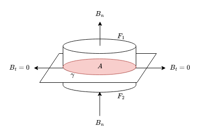
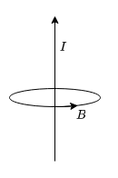
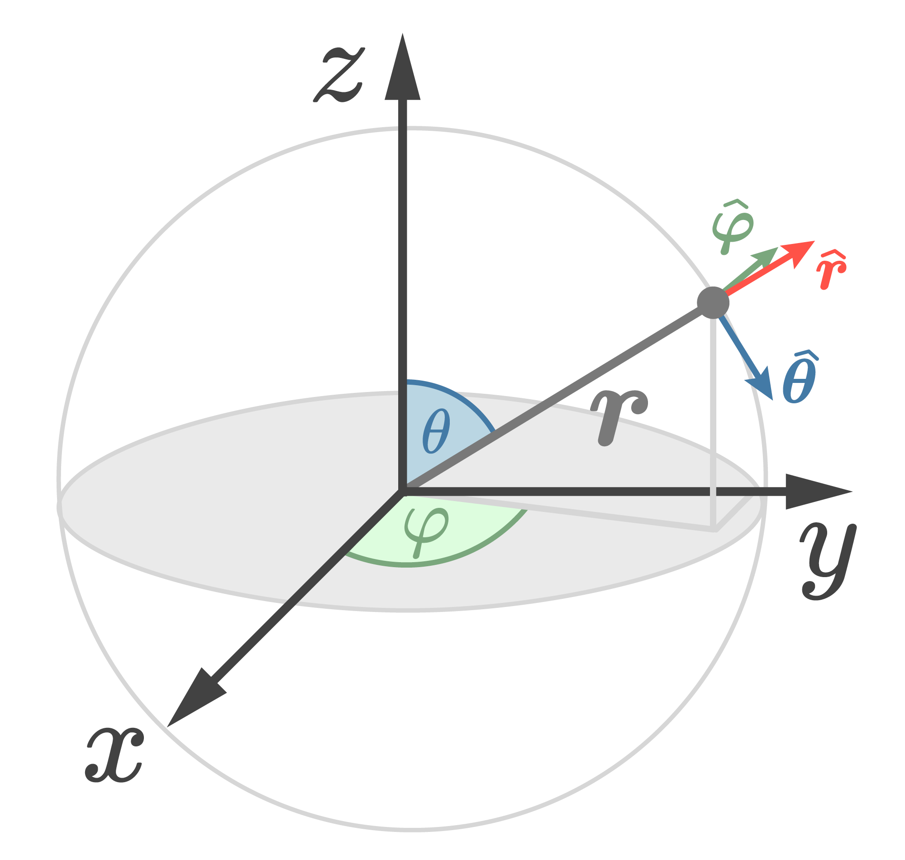
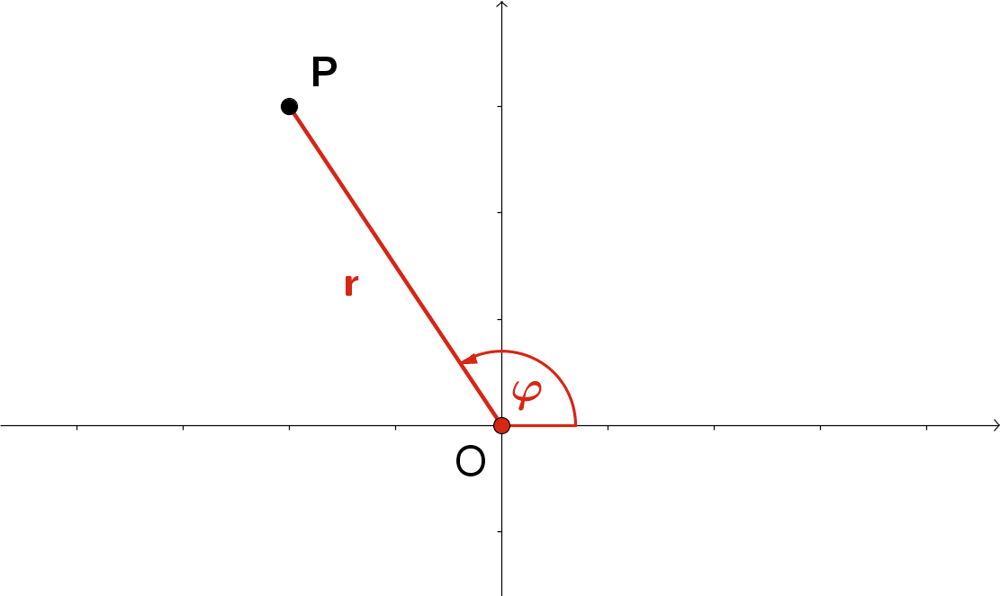
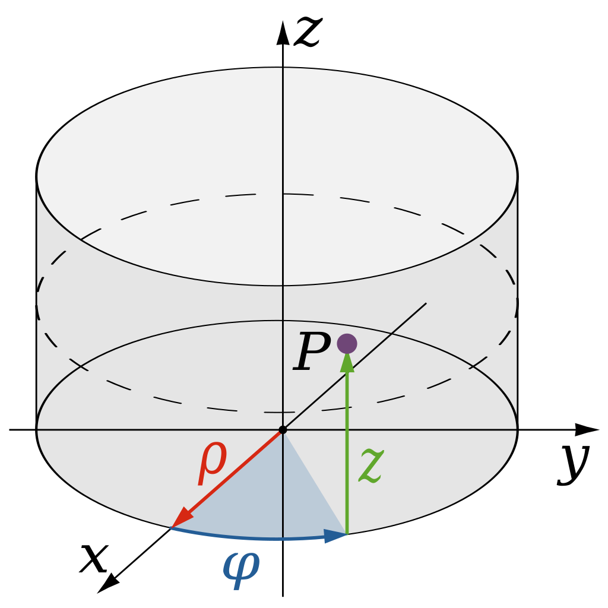

## 1. Allgemeine Formeln
### Ampére'sches Gesetz in Integralform
$$\oint_C\boldsymbol{B}\cdot dl=\mu_0\int_S\boldsymbol{J}\cdot d\boldsymbol{A}=\mu_0\cdot I_{enclosed}$$
### Gauß'sches Gesetz in Integralform
$$\oint_S\boldsymbol{E}\cdot d\boldsymbol{A}=\frac{1}{\epsilon_0}\cdot\int_V\rho(\boldsymbol{x})\cdot d^3x=\frac{Q_{enclosed}}{\epsilon_0}$$
### Green'sche Funktion des Laplaceoperators
$$G=-\frac{1}{4\pi}\int d^3x'\frac{1}{|x_m-x_m'|}$$

---

## 2. Magnetostatische Maxwell-Gleichungen
### 1. Maxwell-Gleichung
#### Elektrostatik
$$\boldsymbol{\nabla}\cdot \boldsymbol{E}=\partial_iE_i(x_m)=\frac{\rho(x_m)}{\epsilon_0}$$

#### Magnetostatik
$$\boldsymbol{\nabla}\cdot\boldsymbol{B}=\partial_iB_i(x_m)=0$$

### 2. Maxwell-Gleichung
#### Elektrostatik
$$\boldsymbol{\nabla}\times\boldsymbol{E}=\epsilon_{ijk}\partial_jE_k(x_m)=0$$

#### Magnetostatik
$$\boldsymbol{\nabla}\times\boldsymbol{B}=\epsilon_{ijk}\partial_jB_k(x_m)=\mu_0\cdot J_i(x_m)$$

---

## 4. Nabla Rechenregeln
1. $\boldsymbol{\nabla}\cdot\boldsymbol{\nabla}=\boldsymbol{\nabla}^2=\boldsymbol{\Delta}$
2. $\boldsymbol{\nabla}\times\left(\boldsymbol{\nabla}\times\boldsymbol{A}\right)=\boldsymbol{\nabla}\left(\boldsymbol{\nabla}\cdot\boldsymbol{A}\right)-\boldsymbol{\nabla}^2\boldsymbol{A}$
3. $\boldsymbol{\nabla}\cdot\left(\boldsymbol{\nabla}\varphi\right)=\boldsymbol{\nabla}^2\varphi$
4. $\boldsymbol{\nabla}\cdot\left(\boldsymbol{\nabla}\times\boldsymbol{A}\right)=0$
5. $\boldsymbol{\nabla}\times\left(\boldsymbol{\nabla}\varphi\right)=0$

---

## 5. Erste Theoriefragen
### 2019

> Zeigen Sie die Quellfreiheit des Magnetfelds $B_i(x_m)$ unter Verwendung des Amperéschen Ausdrucks, welcher $B_i(x_m)$ in Abhängigkeit von der Volumsstromdichte $J_i(x_m)$ darstellt.

Die Quellenfreiheit des magnetischen Feldes $\boldsymbol{B}$ ist über den magnetischen Hüllenfluss definiert. Dieser besagt, dass der durch eine geschlossene Fläche austretende magnetische Fluss zu jedem Zeitpunkt gleich Null sein muss:
$$\oint_{\partial V}\boldsymbol{B}\cdot dA=0$$
Der Gauß'sche Integralsatz besagt, dass für ein vom Rand $\partial V$ eingeschlossenes Volumen $V$, für ein beliebiges Vektorfeld $\boldsymbol{B}$, geschrieben werden kann:
$$\int d^3V\partial_iB_i=\oint_{\partial V}dA_iB_i$$
Somit kann die Quellenfreiheit des magnetischen Feldes $\boldsymbol{B}$ wie folgt beschrieben werden:
$$\oint_{\partial V}\boldsymbol{B}\cdot dA=\int_V\text{div }\boldsymbol{B}\cdot dV=0$$
In differentieller Form entspricht dieser Zusammenhang:
$$\text{div }\boldsymbol{B}=0$$

---

Das Magnetfeld $\boldsymbol{B}$ kann über den Ampéreschen Ausdruck, welcher das magnetische Feld $\boldsymbol{B}$ in Abhängigkeit von der elektrischen Stromdichte $\boldsymbol{J}$ definiert, angeschrieben werden:
$$B_i(x_m)=\frac{\mu_0}{4\pi}\cdot\int d^3x'\,\frac{\epsilon_{ijk}\cdot J_i\cdot\left(x_k-x_k'\right)}{|x_m-x_m'|^3}$$
Für später wird die folgende Nebenrechnung benötigt:
$$\partial_k\frac{1}{\underbrace{|\boldsymbol{x}_m-\boldsymbol{x}_m'|}_{\text{Abstand}}}=\partial_k\frac{1}{|\boldsymbol{x}|}=\partial_k\frac{1}{\sqrt{\boldsymbol{x}^2}}=\underbrace{-\frac{1}{2}\cdot\frac{1}{{\sqrt{\boldsymbol{x}^{2}}}^3}}_{\text{äußere Ableitung}}\cdot\partial_k\boldsymbol{x}^2=-\frac{1}{\cancel{2}}\cdot\frac{1}{\sqrt{{\boldsymbol{x}^{2}}}^3}\cdot\underbrace{\cancel{2}\cdot\boldsymbol{x}}_{innere Ableitung}\cdot\delta_{km}$$
$$=-\frac{\boldsymbol{x}_m-\boldsymbol{x}_m'}{|\boldsymbol{x}_m-\boldsymbol{x}_m'|^3}\cdot\delta_{km}=-\frac{\boldsymbol{x}_k-\boldsymbol{x}_k'}{|\boldsymbol{x}_m-\boldsymbol{x}_m'|^3}$$
Aus der Nebenrechnung lässt sich demnach ablesen:
$$-\boldsymbol{\nabla}\frac{1}{|\boldsymbol{x}_m-\boldsymbol{x}_m'|}=\frac{\boldsymbol{x}_k-\boldsymbol{x}_k'}{|\boldsymbol{x}_m-\boldsymbol{x}_m'|^3}$$
Dieser Zusammenhang lässt sich nun in den Ampéreschen Ausdruck für das magnetische Feld $\boldsymbol{B}$ einsetzen:
$$B_i(x_m)=\frac{\mu_0}{4\pi}\cdot\int d^3x'\,\epsilon_{ijk}\cdot J_i\cdot\left(-\partial_k\frac{1}{|x_m-x_m'|}\right)$$
Das Kreuzprodukt $\epsilon_{ijk}$ sowie die Ableitung $\partial_k$ können aus der Integration heraus gehoben werden, nachdem sie von $x$ und nicht von $x'$ abhängig sind bzw. sich darauf beziehen. Dadurch folgt:
$$B_i(x_m)=\epsilon_{ijk}\cdot\left(-\partial_k\right)\cdot\underbrace{\left(\frac{\mu_0}{4\pi}\cdot\int d^3x'\,\frac{J_i}{|x_m-x_m'|}\right)}_{=A_j\left(x_m\right)}$$
Der hintere Teil der Gleichung entspricht nun dem magnetischen Vektorpotential $\boldsymbol{A}$. Demnach kann der Ausdruck wie folgt vereinfacht werden:
$$B_i(x_m)=\epsilon_{ijk}\cdot\left(-\partial_j\right)\cdot A_k\left(x_m\right)$$

---

Wie bereits in der Einleitung des Beispiels beschrieben, muss für die Quellenfreiheit des magnetischen Feldes $\boldsymbol{B}$ in differentieller Form gelten:
$$\text{div }\boldsymbol{B}=\partial_iB_i(x_m)=0$$
Eingesetzt folgt entsprechend:
$$\partial_iB_i(x_m)=\partial_i\epsilon_{ijk}\partial_jA_k(x_m)=\epsilon_{ijk}\partial_i\partial_jA_k(x_m)$$
Setzt man die Symmetrien der einzelnen Ausdrücke ein, kann geschrieben werden:
$$\partial_iB_i(x_m)=\underset{\vee}{\epsilon_{ijk}}\underset{\cup}{\partial_i\partial_j}A_k(x_m)$$
Mit:
$$\vee\rightarrow\text{antisymmetrisch}$$
$$\cup\rightarrow\text{symmetrisch}$$
Die Multiplikation einer symmetrischen und einer antisymmetrischen Funktion ergibt jedenfalls $0$. Der Nachweis dafür ist wie folgt:
$$A_{ij}\cdot S_{ij}=-A_{ji}\cdot S_{ji}\underset{umbenennen}{=}-A_{ij}\cdot S_{ij}$$
$$\implies2\cdot A_{ij}\cdot S_{ij}=0$$
Dadurch folgt, dass die Multiplikation eines antisymmetrischen Vektors mit einem symmetrischen Vektor immer $0$ ergibt. Entsprechend wurde gezeigt, dass gilt:
$$\partial_iB_i(x_m)=0$$
Das magnetische Feld ist somit quellenfrei!

---

### 2009 / 2011 / 2013

> Zeigen Sie unter Zuhilfenahme des Biot-Savart’schen Ausdrucks für das Magnetfeld $B_i(x_m)$ in Abhängigkeit von der Volumsstromdichte $J_i(x_m)$ die Divergenzfreiheit von $B_i(x_m)$.

Gemäß dem Biot-Savart-Gesetz erzeugt ein Stromleiter mit dem infinitesimalen Längenelement $d\boldsymbol{l}$, welcher sich an dem Ort $\boldsymbol{r}'$ befindet und von einem Strom $I$ durchflossen wird, am Ort $\boldsymbol{r}$ die magnetische Flussdichte $d\boldsymbol{B}$:
$$d\boldsymbol{B}=\frac{\mu_0}{4\pi}\frac{I\,d\boldsymbol{l}\times\boldsymbol{\hat{r}}}{r^2}$$
Der Vektor $\boldsymbol{\hat{r}}$ ist dabei wie folgt definiert:
$$\boldsymbol{\hat{r}}=\frac{\vec{r}}{|r|}$$
Umgeschrieben entspricht der Ausdruck für die magnetische Flussdichte $\boldsymbol{B}$ am Ort $\boldsymbol{r}$ somit:
$$d\boldsymbol{B}(\boldsymbol{r})=\frac{\mu_0}{4\pi}\cdot I\,d\boldsymbol{l}\times\frac{\boldsymbol{r}-\boldsymbol{r}'}{|\boldsymbol{r}-\boldsymbol{r}'|^3}$$
Durch Aufsummieren der infinitesimalen Anteile und durch Umwandeln des entstehenden Wegintegrals in ein Volumensintegral folgt die Integralform des Biot-Savart-Gesetzes: ($\boldsymbol{J}$ entspricht der elektrischen Stromdichte)
$$\boldsymbol{B}(\boldsymbol{r})=\frac{\mu_0}{4\pi}\cdot\int_V\boldsymbol{J}(\boldsymbol{r})\times\frac{\boldsymbol{r}-\boldsymbol{r}'}{|\boldsymbol{r}-\boldsymbol{r}'|^3}\,dV'$$
Dieser kann in die bereits eingangs beschriebene Berechnung eingesetzt werden.

---

### 2013 Ersatztest

>Unter Verwendung des Biot-Savart’schen Ausdrucks für das Magnetfeld $B_i(x_m)$ in Abhängigkeit von der Volumsstromdichte $J_i(x_m)$ zeige man die Abwesenheit von magnetischer Ladung.

Die Abwesenheit von magnetischer Ladung ist äquivalent zu der Quellfreiheit des magnetischen Feldes.

---

## 6. Zweite Theoriefragen
### 2019

> Für zwei Flächen $F_1$ und $F_2$, welche durch dieselbe Kurve $\gamma$ berandet werden (d.h. $\partial F_1=\partial F_2=\gamma$), weise man die Gleichheit des magnetischen Flusses durch diese Flächen, unter Verwendung der magnetostatischen Maxwellgleichungen, nach.

Der magentische Fluss $\Phi$ ist allgemein als das Flächenintegral über die magnetische Flussdichte $\boldsymbol{B}$ definiert:
$$\Phi=\int_{S}\boldsymbol{B}\cdot dA$$
Weiters lautet die ersten Maxwell-Gleichung der Magnetostatik:
$$\boldsymbol{\nabla}\cdot\boldsymbol{B}=0$$
Diese Gleichung drückt aus, dass das magnetische Feld quellenfrei ist. Daraus folgt der Satz vom magnetischen Hüllenfluss, welcher besagt, dass der durch eine geschlossene Oberfläche $\partial V$ eines Volumens $V$ austretende magnetische Fluss $\Phi$ stets gleich Null sein muss. Mit dem Satz von Gauß, in Integralform, folgt:
$$\oint_{\partial V}\boldsymbol{B}\cdot d\boldsymbol{A}=\int_{V}\underbrace{\boldsymbol{\nabla}\cdot\boldsymbol{B}}_{=0}\cdot d^3x=0$$
An einer Fläche, wie in unserer Skizze der Fläche $A$, muss entsprechend, gemäß dem Satz vom magnetischen Hüllenfluss, gelten: (gedanklich wird dafür die Höhe der umgebenden "Box" gegen Null approximiert; $1$ und $2$ stehen für die Ober- und Unterseite der Fläche $A$)
$$\Phi=0=\boldsymbol{B}_1\cdot A\cdot\boldsymbol{\hat{n}}-\boldsymbol{B}_2\cdot A\cdot\boldsymbol{\hat{n}}$$
Daraus folgt, dass die Normalkomponente der magnetischen Flussdichte $\boldsymbol{B}_n$ jederzeit kontinuierlich über eine beliebige zweidimensionale Fläche $A$ ist:
$$|[B_n]|=0$$
Nachdem die tangentiale Komponente der magnetischen Flussdichte $\boldsymbol{B}_t$ gleich Null ist (der Fluss durch die Kurve $\gamma$ ist annähernd Null), der gesamt durch die Fläche $F$ austretende magnetische Fluss ebenfalls Null ist, müssen die Flüsse durch die Flächen $F_1$ und $F_2$ gleich aber entgegengesetzt sein:
$$\int_{F_1}\boldsymbol{B}_n\cdot dA=\int_{F_2}\boldsymbol{B}_n\cdot dA$$

---

### 2013

> Unter Verwendung der magnetostatischen Maxwellgleichungen bestimme man die Rotation der Volumensstromdichte $J_i(x_m)$. Den so gewonnen Ausdruck löse man nach $B_i(x_m)$ unter Zuhilfenahme der Green-Funktion des Laplace-Operators auf.

Die zweite Maxwell-Gleichung der Magnetostatik, das Ampéresche Gesetz, lautet:
$$\boldsymbol{\nabla}\times\boldsymbol{B}=\mu_0\cdot\boldsymbol{J}$$
Basierend auf diesem Zusammenhang kann man die Rotation der elektrischen Stromdichte $\boldsymbol{J}$ ermitteln. Hierzu werden beide Seite der Gleichung um das Kreuzprodukt mit Nabla erweitert:
$$\boldsymbol{\nabla}\times\left(\boldsymbol{\nabla}\times\boldsymbol{B}\right)=\mu_0\cdot\left(\boldsymbol{\nabla}\times\boldsymbol{J}\right)$$
Gemäß der Rechenregeln des Nabla Operators kann die linke Seite der Gleichung $\boldsymbol{\nabla}\times\left(\boldsymbol{\nabla}\times\boldsymbol{B}\right)$ wie folgt umgeschrieben werden:
$$\boldsymbol{\nabla}\left(\boldsymbol{\nabla}\cdot\boldsymbol{B}\right)-\boldsymbol{\nabla}^2\boldsymbol{B}=\mu_0\cdot\left(\boldsymbol{\nabla}\times\boldsymbol{J}\right)$$
Weiters ist gemäß der ersten Maxwell-Gleichung der Magnetostatik die Divergenz der magnetischen Flussdichte $\boldsymbol{\nabla}\cdot\boldsymbol{B}$ stets gleich Null. Somit folgt:
$$\underbrace{\boldsymbol{\nabla}\left(0\right)}_{=0}-\boldsymbol{\nabla}^2\boldsymbol{B}=\mu_0\cdot\left(\boldsymbol{\nabla}\times\boldsymbol{J}\right)$$
Nun kann, wie in der Angabe beschrieben, die Green'sche Funktion des Laplaceoperators $G$ angewendet werden. Diese lautet in Integralform:
$$G=-\frac{1}{4\pi}\cdot\frac{1}{|\boldsymbol{x}-\boldsymbol{x}'|}$$
Eingesetzt folgt somit:
$$G=\mu_0\cdot\int_VG(\boldsymbol{x}-\boldsymbol{x}')\cdot\left(\boldsymbol{\nabla}\times\boldsymbol{J}\left(\boldsymbol{x'}\right)\right)\,d^3x'$$
Somit folgt für den Ausdruck der magnetischen Flussdichte $\boldsymbol{B}$:
$$\boldsymbol{B}=+\frac{\mu_0}{4\pi}\cdot\int_V\frac{\boldsymbol{\nabla}\times\boldsymbol{J}\left(\boldsymbol{x}'\right)}{|\boldsymbol{x}-\boldsymbol{x}'|}\,d^3x'$$
Beziehungsweise in Indexschreibweise:
$$B_i(x_m)=\frac{\mu_0}{4\pi}\cdot\int_V\frac{\epsilon_{ijk}\cdot\partial_j\cdot J_k\left(x_m'\right)}{|x_m-x_m'|}\,d^3x'$$
Die Ableitung des resultierenden Ausdrucks für die magnetische Flussdichte $\boldsymbol{B}$ kann in weiterer Folge aufgelöst werden:
$$\partial_k\frac{1}{\underbrace{|\boldsymbol{x}_m-\boldsymbol{x}_m'|}_{\text{Abstand}}}=\partial_k\frac{1}{|\boldsymbol{x}|}=\partial_k\frac{1}{\sqrt{\boldsymbol{x}^2}}=\underbrace{-\frac{1}{2}\cdot\frac{1}{{\sqrt{\boldsymbol{x}^{2}}}^3}}_{\text{äußere Ableitung}}\cdot\partial_k\boldsymbol{x}^2=-\frac{1}{\cancel{2}}\cdot\frac{1}{\sqrt{{\boldsymbol{x}^{2}}}^3}\cdot\underbrace{\cancel{2}\cdot\boldsymbol{x}}_{innere Ableitung}\cdot\delta_{km}$$
$$=-\frac{\boldsymbol{x}_m-\boldsymbol{x}_m'}{|\boldsymbol{x}_m-\boldsymbol{x}_m'|^3}\cdot\delta_{km}=-\frac{\boldsymbol{x}_k-\boldsymbol{x}_k'}{|\boldsymbol{x}_m-\boldsymbol{x}_m'|^3}$$
Aus der Nebenrechnung lässt sich demnach ablesen:
$$-\boldsymbol{\nabla}\frac{1}{|\boldsymbol{x}_m-\boldsymbol{x}_m'|}=\frac{\boldsymbol{x}_k-\boldsymbol{x}_k'}{|\boldsymbol{x}_m-\boldsymbol{x}_m'|^3}$$
Dieser Zusammenhang lässt sich nun in den Ausdruck für die magnetische Flussdichte $\boldsymbol{B}$ einsetzen, wodurch final der Ampéresche Ausdruck für das magnetische Feld $\boldsymbol{B}$ folgt:
$$B_i(x_m)=\frac{\mu_0}{4\pi}\cdot\int d^3x'\,\frac{\epsilon_{ijk}\cdot J_j\left(x_m'\right)\cdot\left(x_k-x_k'\right)}{|x_m-x_m'|}$$

---

### Herleitung ohne Altfrage

Die zweite Maxwell-Gleichung der Magnetostatik, das Ampéresche Gesetz, lautet:
$$\boldsymbol{\nabla}\times\boldsymbol{B}=\mu_0\cdot\boldsymbol{J}$$
In diesen Ausdruck kann man den Zusammenhang zwischen der magnetischen Flussdichte $\boldsymbol{B}$ und des magnetischen Vektorpotentials $\boldsymbol{A}$ einsetzen:
$$\boldsymbol{B}=\boldsymbol{\nabla}\times\boldsymbol{A}$$
Damit folgt:
$$\boldsymbol{\nabla}\times\left(\boldsymbol{\nabla}\times\boldsymbol{A}\right)=\mu_0\cdot\boldsymbol{J}$$
Die linke Seite des Zusammenhangs kann gemäß der Rechenregeln des Nabla-Operators $\boldsymbol{\nabla}$ umgeformt werden:
$$\boldsymbol{\nabla}\left(\boldsymbol{\nabla}\cdot\boldsymbol{A}\right)-\boldsymbol{\nabla}^2\boldsymbol{A}=\mu_0\cdot\boldsymbol{J}$$
Gemäß der Coulomb-Eichung ist das Vektorpotential $\boldsymbol{A}$ divergenzfrei. Entsprechend gilt:
$$\boldsymbol{\nabla}\cdot\boldsymbol{A}=0$$
Somit folgt für den Ausdruck basierend auf dem Ampéreschen Gesetz:
$$\boldsymbol{\nabla}\left(0\right)-\boldsymbol{\nabla}^2\boldsymbol{A}=\mu_0\cdot\boldsymbol{J}$$
Nachdem der Gradient von Null $\boldsymbol{\nabla}\left(0\right)$ ebenfalls Null ist, kann weiters geschrieben werden:
$$-\boldsymbol{\nabla}^2\boldsymbol{A}=\mu_0\cdot\boldsymbol{J}$$
In diesen Ausdruck kann gemäß der Angabe die Greensche Funktion des Laplaceoperators $\boldsymbol{\nabla}^2$ eingesetzt werden. Diese lautet im dreidimensionalen Raum:
$$G=-\frac{1}{4\pi}\cdot\frac{1}{|x_m-x_m'|}$$
Eingesetzt folgt damit:
$$\boldsymbol{A}\left(\boldsymbol{x}\right)=\mu_0\cdot\int G\left(\boldsymbol{x}-\boldsymbol{x}'\right)\cdot\boldsymbol{J}\left(\boldsymbol{x}'\right)\,d^3x'$$
Final folgt somit der Ausdruck für das magnetische Vektorpotential $\boldsymbol{A}$:
$$\boldsymbol{A}\left(\boldsymbol{x}\right)=\frac{\mu_0}{4\pi}\cdot\int d^3x'\frac{\boldsymbol{J}\left(\boldsymbol{x}'\right)}{|\boldsymbol{x}-\boldsymbol{x}'|}$$
Gemäß der Coulomb-Eichung muss gelten, dass die Divergenz des magnetischen Vektorpotentials $\boldsymbol{A}$ gleich Null ist. Auf die Lösung angewandt ist diese Beziehung gegeben, da die Divergenz der elektrischen Stromdichte $\boldsymbol{\nabla}\cdot\boldsymbol{J}$ ebenfalls gleich Null ist.

---

### 2013 Ersatztest

> Zeigen Sie unter Verwendung der zweiten magnetostatischen Maxwellgleichung, dem Ampéreschen Gesetz, die Divergenzfreiheit der Stromdichte $J_i(x_m)$.

Das Ampéresche Gesetz, die zweite Maxwell-Gleichung der Magnetostatik, lautet:
$$\boldsymbol{\nabla}\times\boldsymbol{B}=\mu_0\cdot\boldsymbol{J}$$
Leitet man aus diesem Gesetz die Divergenz der elektrischen Stromdichte $\boldsymbol{J}$ ab, folgt:
$$\boldsymbol{\nabla}\cdot\boldsymbol{J}=\frac{1}{\mu_0}\cdot\left(\boldsymbol{\nabla}\cdot\left(\boldsymbol{\nabla}\times\boldsymbol{B}\right)\right)$$
Die Divergenz der Rotation eines Vektorfeldes $\boldsymbol{\nabla}\cdot\left(\boldsymbol{\nabla}\times\boldsymbol{B}\right)$ ist in allen Fällen $0$. Dieser Zusammenhang lässt sich wie folgt nachweisen:
$$\underset{\vee}{\epsilon_{ijk}}\cdot\underset{\cup}{\partial_j\cdot\partial_k}B_i=0$$$$\vee\rightarrow\text{antisymmetrisch}$$$$\cup\rightarrow\text{symmetrisch}$$Die Multiplikation einer symmetrischen und einer antisymmetrischen Funktion ergibt jedenfalls $0$. Der Nachweis dafür ist wie folgt:
$$A_{ij}\cdot S_{ij}=-A_{ji}\cdot S_{ji}\underset{umbenennen}{=}-A_{ij}\cdot S_{ij}$$
$$\implies2\cdot A_{ij}\cdot S_{ij}=0$$
Dadurch folgt, dass die Multiplikation eines antisymmetrischen Vektors mit einem symmetrischen Vektor $0$ ergibt. Damit folgt für die Divergenz der Stromdichte $\boldsymbol{\nabla}\cdot\boldsymbol{J}$:
$$\boldsymbol{\nabla}\cdot\boldsymbol{J}=\frac{1}{\mu_0}\cdot0=0$$
Somit wurde gezeigt, dass die elektrische Stromdichte $\boldsymbol{J}$ für statische Systeme divergenzfrei ist.

---

### 2011

> Zeigen Sie, dass die stationäre (zeitunabhängige) Kontinuitätsgleichung $\partial_iJ_i=-\frac{\partial\rho}{\partial t}$ eine direkte Konsequenz des Ampere’schen Gesetzes zwischen Magnetfeld $B_i(x_k)$ und Volumsstromdichte $J_i(x_k)$ darstellt.

Das Ampéresche Gesetz, die zweite Maxwell-Gleichung der Magnetostatik, lautet:
$$\boldsymbol{\nabla}\times\boldsymbol{B}=\mu_0\cdot\boldsymbol{J}$$
Dieser Ausdruck gilt lediglich für statische Systeme. In einem statischen System ist $\frac{\partial\rho}{\partial t}$ und somit auch $\boldsymbol{\nabla}\cdot\boldsymbol{J}$ gleich $0$. In zeitabhängigen Systemen ist dieser Ausdruck jedoch nicht korrekt. In solchen Systemen muss zu der elektrischen Stromdichte $\boldsymbol{J}$ der Verschiebungsstrom *(eng. displacement current)* berücksichtigt werden. Ergänzt man den Verschiebungsstrom in dem Ampéreschen Gesetz, erhält man das Ampére-Maxwell-Gesetz:
$$\boldsymbol{\nabla}\times\boldsymbol{B}=\mu_0\cdot\left(\boldsymbol{J}+\epsilon_0\cdot\frac{\partial\boldsymbol{E}}{\partial t}\right)$$
Basierend auf diesem Zusammenhang kann die Divergenz der elektrischen Stromdichte $\boldsymbol{\nabla}\cdot\boldsymbol{J}$ ermittelt werden:
$$\boldsymbol{\nabla}\cdot\left(\boldsymbol{\nabla}\times\boldsymbol{B}\right)=\mu_0\cdot\boldsymbol{\nabla}\cdot\left(\boldsymbol{J}+\epsilon_0\cdot\frac{\partial\boldsymbol{E}}{\partial t}\right)=\mu_0\cdot\left(\boldsymbol{\nabla}\cdot\boldsymbol{J}+\epsilon_0\cdot\boldsymbol{\nabla}\cdot\frac{\partial\boldsymbol{E}}{\partial t}\right)$$
Gemäß der ersten Maxwell-Gleichung der Elektrostatik entspricht $\epsilon_0\cdot\left(\boldsymbol{\nabla}\cdot\boldsymbol{E}\right)$ gleich:
$$\boldsymbol{\nabla}\cdot\boldsymbol{E}=\frac{\rho}{\epsilon_0}\rightarrow\epsilon_0\cdot\left(\boldsymbol{\nabla}\cdot\boldsymbol{E}\right)=\rho$$
Somit kann wie folgt in die Divergenz der elektrischen Stromdichte eingesetzt werden:
$$\boldsymbol{\nabla}\cdot\left(\boldsymbol{\nabla}\times\boldsymbol{B}\right)=\mu_0\cdot\left(\boldsymbol{\nabla}\cdot\boldsymbol{J}+\frac{\partial\rho}{\partial t}\right)$$
Die Divergenz der Rotation eines Vektorfeldes $\boldsymbol{\nabla}\cdot\left(\boldsymbol{\nabla}\times\boldsymbol{B}\right)$ ist in allen Fällen $0$. Dieser Zusammenhang lässt sich wie folgt nachweisen:
$$\underset{\vee}{\epsilon_{ijk}}\cdot\underset{\cup}{\partial_j\cdot\partial_k}B_i=0$$$$\vee\rightarrow\text{antisymmetrisch}$$$$\cup\rightarrow\text{symmetrisch}$$Die Multiplikation einer symmetrischen und einer antisymmetrischen Funktion ergibt jedenfalls $0$. Der Nachweis dafür ist wie folgt:
$$A_{ij}\cdot S_{ij}=-A_{ji}\cdot S_{ji}\underset{umbenennen}{=}-A_{ij}\cdot S_{ij}$$
$$\implies2\cdot A_{ij}\cdot S_{ij}=0$$
Dadurch folgt, dass die Multiplikation eines antisymmetrischen Vektors mit einem symmetrischen Vektor $0$ ergibt. Damit folgt für die Divergenz der Stromdichte $\boldsymbol{\nabla}\cdot\boldsymbol{J}$:
$$0=\mu_0\cdot\left(\boldsymbol{\nabla}\cdot\boldsymbol{J}+\frac{\partial\rho}{\partial t}\right)=\boldsymbol{\nabla}\cdot\boldsymbol{J}+\frac{\partial\rho}{\partial t}$$
Somit ergibt sich final:
$$\boldsymbol{\nabla}\cdot\boldsymbol{J}=-\frac{\partial\rho}{\partial t}$$

---

## 7. Der elektrische Strom
Allgemein gelten für den elektrischen Strom die folgenden Zusammenhänge:
$$I=\oint_S\boldsymbol{J}\cdot\boldsymbol{\hat{n}}\cdot d\boldsymbol{A}=\sigma\cdot\oint_S\boldsymbol{E}\cdot\boldsymbol{\hat{n}}\cdot d\boldsymbol{A}=\sigma\cdot\int_V\boldsymbol{\nabla}\cdot\boldsymbol{E}\cdot d^3x=\frac{\sigma}{\epsilon}\cdot\int_V\rho\cdot d^3x=\frac{\sigma}{\epsilon}\cdot Q$$

### Ohm'sches Gesetz
$U$ entspricht der elektrischen Spannung. $I$ entspricht dem elektrischen Strom. $R$ entspricht dem elektrischen Widerstand.
$$U=I\cdot R$$
Der elektrische Widerstand $R$ eines Zylinders lässt sich beispielsweise wie folgt berechnen:
$$R=\frac{L}{\sigma\cdot A}$$
$L$ entspricht der Länge des Zylinders und $A$ dessen Querschnittsfläche.
Die elektrische Leitfähigkeit $\sigma$ lässt sich auch durch den spezifischen Widerstand $\rho$ ausdrücken:
$$\sigma=\frac{1}{\rho}$$
### Lokale Form des Ohm'schen Gesetzes
Die lokale Form des Ohm'schen Gesetzes ist:
$$\boldsymbol{J}\left(\boldsymbol{x}\right)=\sigma\cdot\boldsymbol{E}\left(\boldsymbol{x}\right)$$

### Joule'sches Gesetz
Das Joule'sche Gesetz definiert die Leistung $P$ basierend auf dem Strom $I$, der Spannung $U$ und dem Widerstand $R$:
$$P=U\cdot I=I^2\cdot R$$

### Elektrische Stromdichte
Sei $d\boldsymbol{A}$ ein infinitesimales Flächenstück, dann ist $dI$ die Ladung, welche pro Zeiteinheit das Flächenstück $d\boldsymbol{A}$ passiert:
$$dI=\boldsymbol{J}\cdot d\boldsymbol{A}$$
Die elektrische Stromdichte ist unter anderem wie folgt definiert. $n$ entspricht dabei der Anzahl an Ladungen pro Volumenseinheit. $q$ ist die Ladung der einzelnen Ladungsträger. $\boldsymbol{v}$ entspricht der mittleren Geschwindigkeit der Ladungen. $\rho$ entspricht der elektrischen Raumladungsdichte.
$$\boldsymbol{J}=\underbrace{q\cdot n}_{=\rho}\cdot\boldsymbol{v}$$
### Stationäre Kontinuitätsgleichung
Die stationäre Kontinuitätsgleichung besagt, dass der Fluss von Ladung, aus einem Volumen $V$, in besagtem Volumen $V$ zu einer Abnahme der Ladung führt. $\boldsymbol{J}$ entspricht der Volumensstromdichte. $\rho$ entspricht der Volumensladungsdichte.
$$\boldsymbol{\nabla}\cdot\boldsymbol{J}=-\frac{\partial\rho}{\partial t}$$
In Integralform entspricht der Zusammenhang:
$$\oint_S\boldsymbol{J}\cdot d\boldsymbol{A}=-\frac{d}{dt}\int_V\rho\cdot d^3x$$

---

## 8. Das elektrische Potential
$$V(\boldsymbol{x})=\frac{1}{4\pi\cdot\epsilon_0}\cdot\int\frac{\rho(\boldsymbol{x'})}{|\boldsymbol{x}-\boldsymbol{x'}|}\,d^3x'$$
Ist das elektrische Feld $\boldsymbol{E}$ bekannt, gilt für das elektrische Potential:
$$V\left(\boldsymbol{x}\right)=-\int_{\Gamma}\boldsymbol{E}\left(\boldsymbol{x}\right)\cdot dl$$
Das elektrische Potential entspricht dem Wegintegral von $x_0$ nach $x$.

---

## 9. Das magnetische Feld

Das magnetische Feld $\boldsymbol{B}$ ist stets in $\vec{e}_{\varphi}$ ausgerichtet. Die Ausrichtung entspricht im Falle einer Kugel auch:
$$\vec{e}_B=\vec{e}_{\varphi}=\vec{e}_I\times\vec{e}_r$$
Hierbei ist $\vec{e}_I$ die Richtung des Stromes und $\vec{e}_r$ die Richtung des Radius $R$.

### Ampérescher Ausdruck für das Magnetfeld
$$B_i(x_m)=\frac{\mu_0}{4\pi}\int_{wire}d^3x'\,\frac{\epsilon_{ijk}J_i(x_m')(x_k-x_k')}{|x_m-x_m'|^3}$$
Der Tensor $x_m$ entspricht dem **Referenzpunkt**.
Der Tensor $x_m'$ entspricht dem **Quellpunkt**.

### Biot-Savart'scher Ausdruck für das Magnetfeld
$$d\boldsymbol{B}=\frac{\mu_0}{4\pi}\frac{I\,d\boldsymbol{l}\times\boldsymbol{\hat{r}}}{r^2}$$
In Integralform entspricht der Ausdruck:
$$\boldsymbol{B}(\boldsymbol{x})=\frac{\mu_0}{4\pi}\int_{wire}d^3x'\,\frac{I\,dl\times\boldsymbol{\hat{r}}}{r^2}=\frac{\mu_0}{4\pi}\int_{wire}d^3x'\,\frac{I\,dl\times(\boldsymbol{x}-\boldsymbol{x}')}{|\boldsymbol{x}-\boldsymbol{x}'|^3}$$

### Langer gerader Draht
Das magnetische Feld für einen langen geraden Draht ist über die folgende Formel definiert:
$$\boldsymbol{B}\left(\boldsymbol{x}\right)=\frac{\mu_0\cdot I}{2\pi\cdot R}\cdot\boldsymbol{\hat{\Phi}}$$
$R$ entspricht dabei dem Radius des Leiters.

### Kraft
Die auf ein Teilchen mit der Ladung $q$ wirkende Kraft, verursacht durch ein Magnetfelt mit der magnetischen Flussdichte $\boldsymbol{B}$, entspricht:
$$\boldsymbol{F}=q\boldsymbol{v}\times\boldsymbol{B}$$

---

## 10. Das magnetische Vektorpotential
Das magnetische Vektorpotential $\boldsymbol{A}$ hängt wie folgt mit der magnetischen Flussdichte $\boldsymbol{B}$ zusammen:
$$\boldsymbol{B}=\boldsymbol{\nabla}\times\boldsymbol{A}$$

---

## 11. Integralsätze
![[Brain/Studying/Elektrodynamik I 136.015/1. Klausur/images/Integralsätze.png]]
### Gaußscher Integralsatz
Der Satz von Gauß lautet für ein vom Rand $\partial V$ eingeschlossenes Volumen $V$ für ein beliebiges Vektorfeld mit den Komponenten $E_i$:
$$\int d^3V\partial_iE_i=\oint_{\partial V}dA_iE_i$$wobei $A_i$ die Komponenten des (stets nach außen gerichteten) Flächennormalvektors am Rand des Volumens sind.

### Stokescher Integralsatz
Der Satz von Stokes verknüpft ein Oberflächenintegral über eine (gekrümmte) Fläche mit einem Kurvenintegral über den Rand der Fläche:
$$\int_SdA_i\epsilon_{ijk}\partial_jF_k=\oint_{\partial S}ds_iF_i$$

---

## 12. Randbedingungen
$$|[E_t]|=0$$
$$|[D_n]|=0$$
$$|[B_n]|=0$$

---

## 13. Der Kondensator
### Ladung
Allgemein gilt für die Ladung $Q$ in einem Kondensator der folgende Zusammenhang mit der elektrischen Spannung $U$ und der Kapazität $C$:
$$Q=C\cdot U$$
Daraus folgt mit dem Ohm'schen Gesetz:
$$R\cdot C=\frac{\epsilon}{\sigma}$$

---

## 14. Das elektrische Feld
### Allgemeine Zusammenhänge
$$U=s\cdot E$$$$F=q\cdot E$$$$E=-\nabla V$$

---

## 15. Geometrien
### Kugelkoordinaten

$$\vec{r}(R,\theta,\varphi)=\left[{\begin{array}{cc} R\cdot\sin{\theta}\cdot\cos{\varphi} \\ R\cdot\sin{\theta}\cdot\sin{\varphi} \\ R\cdot\cos{\theta} \\ \end{array} }\right]$$
Bzw. mit einer anderen Parametrisierung:
$$\vec{r}(R,s,t)=\left[{\begin{array}{cc} R\cdot\sin{s}\cdot\cos{t} \\ R\cdot\sin{s}\cdot\sin{t} \\ R\cdot\cos{s} \\ \end{array} }\right]$$
In Kugelkoordinaten gilt:
$$dV=r^2\cdot\sin{\theta}$$
Zum Beispiel:
$$\int_VE\,dV=\int_0^R\int_0^{2\pi}\int_0^{\pi}E\,d\theta d\varphi dr=\int_0^R\int_0^{2\pi}\int_0^{\pi}E\cdot r^2\cdot\sin{\theta}\,dr=4\pi\cdot\int_0^RE\cdot r^2\,dr$$

---

### Kreiskoordinaten / Polarkoordinaten

$$\vec{r}(R,\varphi)=\left[{\begin{array}{cc} R\cdot\cos{\varphi} \\ R\cdot\sin{\varphi} \\ \end{array} }\right]$$
Bzw. mit einer anderen Parametrisierung:
$$\vec{r}(s,t)=\left[{\begin{array}{cc} s\cdot\cos{t} \\ s\cdot\sin{t} \\ \end{array} }\right]$$

---

### Zylinderkoordinaten

$$\vec{r}(R,\varphi)=\left[{\begin{array}{cc} R\cdot\cos{\varphi} \\ R\cdot\sin{\varphi} \\ \end{array} }\right]$$
Bzw. mit einer anderen Parametrisierung:
$$\vec{r}(s,t)=\left[{\begin{array}{cc} s\cdot\cos{t} \\ s\cdot\sin{t} \\ \end{array} }\right]$$

---

%%
## 16. TODOs
- [x] Theoriefragen umbenennen
- [x] Fertigstellen der alten Theoriefragen (Donnerstag Nachmittag)
- [ ] Parallele Drähte – Testaufgabe 2019
	- [x] a)
	- [ ] b)
- [ ] 34 Rotierende geladene Kugel – Testaufgabe 2019
	- [ ] a)
	- [ ] b)
- [ ] 20 Metallkugel - Testaufgabe 2019
	- [ ] a)
	- [ ] b)
- [ ] Rechenbeispiele 2009 - 2013 (2. EdynTest_Theorie_u_Bsp.pdf)
- [ ] Metallkugel (Edyn Test 2_2019.pdf)
- [ ] Luftspule (Edyn Test 2_2019.pdf)
%%