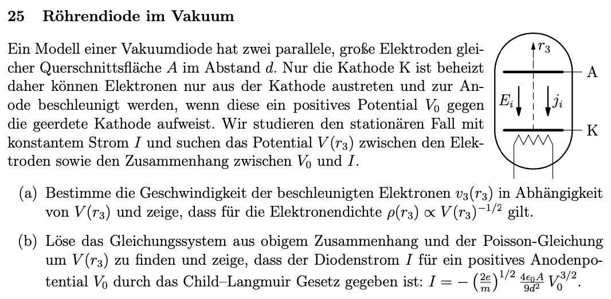
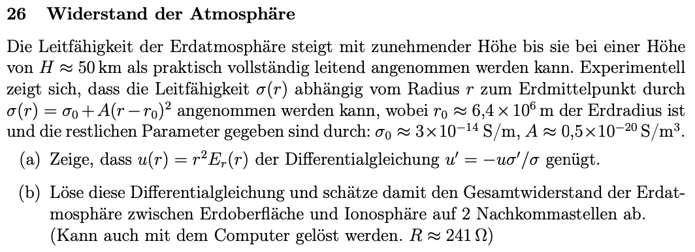
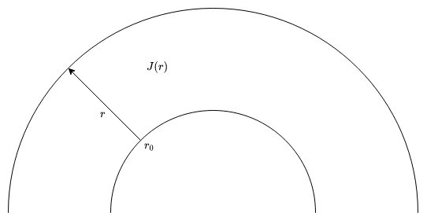
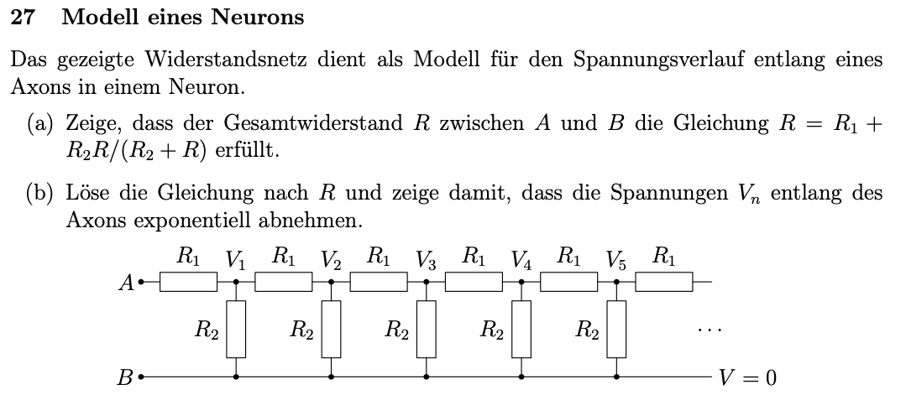
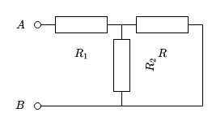
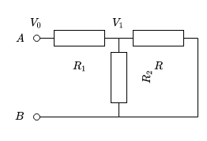

## 9. Problem Set - 01.06.2022
Elektrodynamik I - 136.015

**Gerechnete Beispiele:**
25) a)
26) a)
27) a)

### 25 Röhrendiode im Vakuum

#### a)
Die Beschleunigung von Elektronen beudeutet, dass Energie in kinteische Energie umgesetzt wird. Diese Energie entspricht allgemein:
$$E_{kin}=\frac{m\cdot v^2}{2}$$
In unser Beispiel kann die Masse $m$ mit der Masse eines Elektrons angenommen werden; also $m=m_e=9.1093837015\cdot10^{-31}\,\text{kg}$. Die Geschwindigkeit $v$ entspricht der gesuchten Geschwindigkeit der Elektronen $v_3(r_3)$. Entsprechend folgt für die kinetische Energie:
$$E_{kin}=\frac{m_e\cdot{v_3}^2}{2}$$
Die Energie, welche die Beschleunigung der Elektronen verursacht, ist eine elektrische Energie. Wie bereits in den vergangenen Übungen beschrieben, ist die Formel hierfür:
$$E_{el}=q\cdot V$$
In unserem Fall kann für die Ladung $q$ die Ladung eines Elektrons angenommen werden; also $q=e=−1.602176634\cdot10^{−19}\,\text{C}$. Das in der Formel beschrieben Potential $V$ entspricht dem in der Angabe definierten Potential $V(r_3)$. Somit folgt auch für die elektrische Energie:
$$E_{el}=e\cdot V(r_3)$$
Wie bereits eingangs beschrieben, löst die elektrische Energie eine Beschleunigung der Elektronen aus. Entsprechend folgt die kinetische Energie aus der elektrischen Energie. Die Umwandlung kann durch folgenden Zusammenhang, gemäß der Energieerhaltung, beschrieben werden:
$$E_{el}=E_{kin}$$
$$e\cdot V(r_3)=\frac{m_e\cdot{v_3}^2}{2}$$
Aus diesem Zusammenhang folgt für die Geschwindigkeit des Elektrons $v_3$:
$$v_3(r_3)=\sqrt{\frac{2\cdot e\cdot V(r_3)}{m_e}}$$
Die ermittelte Energie entspricht dabei der Spitzenenergie eines Elektrons vor dem Auftreffen auf die Anode. Da es sich um eine Beschleunigung handelt, ist die Geschwindigkeit nicht konstant.

---

Die Elektronendichte $\rho$ kann in unserem Beispiel aus der Formel für die elektrische Stromdichte $\boldsymbol{J}$ ermittelt werden. Diese lautet gemäß *Electromagnetism* von Gerald L. Pollack und Daniel R. Stump, *Formel 7.4*:
$$\boldsymbol{J}=q\cdot n\cdot\boldsymbol{v}$$
Der Wert $q$ entspricht dabei der Ladung, $n$ ist die *volume number density* und $\boldsymbol{v}$ ist die Geschwindigkeit der Ladungen.
Die *volume number density* $n$ ist definiert als der Quotient der Anzahl der Objekte $N$ und dem Volumen $V$:
$$n=\frac{N}{V}$$
Entsprechend kann man die Formel für die elektrische Stromdichte $\boldsymbol{J}$ wie folgt anschreiben:
$$\boldsymbol{J}=\underbrace{q\cdot\frac{N}{V}}_{\rho}\cdot\boldsymbol{v}$$
Der Term $q\cdot\frac{N}{V}$ beschreibt den Zusammenhang zwischen einer Ladung $q$ und einem Volumen $V$. Dieser Zusammenhand ist äquivalent zu der Elektronendichte $\rho$. Entsprechend folgt für die Beschreibung der elektrischen Stromdichte $\boldsymbol{J}$:
$$\boldsymbol{J}=\rho\cdot\boldsymbol{v}$$
Daraus folgend kann nun die Elektronendichte $\rho(r_3)$ ermittelt werden:
$$\rho(r_3)=\frac{\boldsymbol{J}}{\boldsymbol{v}_3(r_3)}$$
Mit dem eingangs ermittelten Ergebnis für die Geschwindigkeit der Elektronen $v_3(r_3)$ folgt:
$$\rho(r_3)=\frac{J}{\sqrt{\frac{2\cdot e\cdot V(r_3)}{m_e}}}$$
Somit folgt final für die Berechnung der Elektronendichte $\rho(r_3)$:
$$\rho(r_3)=\frac{J}{\sqrt{\frac{2\cdot e}{m_e}}}\cdot{V(r_3)}^{-\frac{1}{2}}$$Es wurde somit gezeigt, dass für die Elektronendichte wie in der Angabe beschrieben gilt:
$$\rho(r_3)\propto V(r_3)^{-\frac{1}{2}}$$

#### b)
%%Die Poisson-Gleichung entspricht allgemein dem folgenden Ausdruck:
$$-\nabla^2V=\frac{\rho}{\epsilon_0}$$
In unserem Fall kann für $\rho$ der in Unterpunkt a) ermittelte Ausdruck eingesetzt werden, wodurch folgt:
$$\nabla^2V=-\frac{J}{\epsilon_0}\cdot\left(\frac{2\cdot e}{m_e}\cdot{V(r_3)}\right)^{-\frac{1}{2}}$$
$$\rightarrow\left(\frac{\partial^2V}{\partial z^2}\right)=-\frac{J}{\epsilon_0}\cdot\left(\frac{2\cdot e}{m_e}\cdot{V(r_3)}\right)^{-\frac{1}{2}}$$
Um auf das Child-Langmuir Gesetz zu kommen, können nun beide Seiten um die Ableitung des Potentials nach $z$ erweitert werden:
$$\frac{\partial V}{\partial z}\left(\frac{\partial^2V}{\partial z^2}\right)=\frac{\partial V}{\partial z}\left(-\frac{J}{\epsilon_0}\cdot\left(\frac{2\cdot e}{m_e}\cdot{V(r_3)}\right)^{-\frac{1}{2}}\right)$$
Die linke Seite der Gleichung kann nun wie folgt vereinfacht werden: (Nachdem die Ableitung des Potentials $V$ nach $z$ zu einer Ableitung von $V^2$ umgeschrieben wird, muss mit $\frac{1}{2}$ erweitert werden.)
# TODO!!! Richtig begründen! Seite 242!!!
$$\frac{\partial V}{\partial z}\left(\frac{\partial^2V}{\partial z^2}\right)=\frac{1}{2}\cdot\frac{\partial}{\partial z}\left(\frac{\partial^2V^2}{\partial z^2}\right)$$
Dadurch folgt:
$$\frac{1}{2}\cdot\frac{\partial}{\cancel{\partial z}}\left(\frac{\partial^2V^2}{\partial z^2}\right)=\frac{\partial V}{\cancel{\partial z}}\left(-\frac{J}{\epsilon_0}\cdot\left(\frac{2\cdot e}{m_e}\cdot{V(r_3)}\right)^{-\frac{1}{2}}\right)$$
$$\frac{\partial^2V^2}{\partial z^2}=2\cdot\partial V\left(-\frac{J}{\epsilon_0}\cdot\left(\frac{2\cdot e}{m_e}\cdot{V(r_3)}\right)^{-\frac{1}{2}}\right)$$
Die zweifache Ableitung der linken Seite kann nun auf eine einfache Ableitung reduziert werden:
$$\frac{\partial V^2}{\partial z^2}=2\cdot\partial V\left(-\frac{J}{\epsilon_0}\cdot\left(\frac{2\cdot e}{m_e}\cdot{V(r_3)}\right)^{-\frac{1}{2}}\right)$$
%%

### 26 Widerstand der Atmosphäre

#### a)

Für $u(r)$ gilt gemäß der Angabe:
$$u(r)=r^2\cdot E_r(r)$$
Das elektrische Feld $E_r(r)$ kann hierbei durch die elektrische Stromdichte $J(r)$ dargestellt werden. Der entsprechende Zusammenhang, die lokale Form des ohm'schen Gesetzes, lautet gemäß *Electromagnetism* von Gerald L. Pollack und Daniel R. Stump, *Formel 7.11*:
$$\boldsymbol{J}(\boldsymbol{r})=\sigma(r)\cdot\boldsymbol{E}(\boldsymbol{r})$$
Damit ergibt sich für $u(r)$:
$$u(r)=r^2\cdot\frac{J(r)}{\sigma(r)}$$
Dieser Ausdruck kann nun in die Differentialgleichung der Angabe eingesetzt werden:
$$u'(r)=-u(r)\cdot\frac{\sigma'(r)}{\sigma(r)}=-r^2\cdot\frac{J(r)}{\sigma(r)}\cdot\frac{\sigma'(r)}{\sigma(r)}$$
---

Der Ausdruck $u'(r)$, der linken Seite, kann ebenfalls durch den zuvor ermittelten Zusammenhang für $E_r(r)$ dargestellt werden:
$$u'(r)=\partial_r\left(r^2\cdot\frac{J(r)}{\sigma(r)}\right)$$
Mit der Produktregel für Ableitungen folgt daraus:
$$=\partial_rr^2\cdot\frac{J(r)}{\sigma(r)}+r^2\cdot\partial_r\left(\frac{J(r)}{\sigma(r)}\right)$$
Weiters kann die Quotientenregel für Ableitungen angewandt werden, woraus folgt:
$$=2\cdot r\cdot\frac{J(r)}{\sigma(r)}+r^2\cdot\frac{J'(r)\cdot \sigma(r)-J(r)\cdot\sigma'(r)}{\sigma^2(r)}$$
Die beiden Brüche können nun auf den selben Nenner gebracht werden:
$$=2\cdot r\cdot\frac{J(r)\cdot\sigma(r)}{\sigma^2(r)}+r^2\cdot\frac{J'(r)\cdot \sigma(r)-J(r)\cdot\sigma'(r)}{\sigma^2(r)}$$
---

Dieser Ausdruck für $u'(r)$ wird folgend wieder in die Differentialgleichung eingesetzt:
$$2\cdot r\cdot\frac{J(r)\cdot\sigma(r)}{\sigma^2(r)}+r^2\cdot\frac{J'(r)\cdot \sigma(r)-J(r)\cdot\sigma'(r)}{\sigma^2(r)}=-r^2\cdot\underbrace{\frac{J(r)}{\sigma(r)}\cdot\frac{\sigma'(r)}{\sigma(r)}}_{=\frac{J(r)\cdot\sigma'(r)}{\sigma^2(r)}}$$
Die Gleichung kann nun mit $\sigma^2(r)$ multipliziert werden. Dadurch ergibt sich:
$$2\cdot r\cdot J(r)\cdot\sigma(r)+r^2\cdot J'(r)\cdot \sigma(r)\cancel{-r^2\cdot J(r)\cdot\sigma'(r)}=\cancel{-r^2\cdot J(r)\cdot\sigma'(r)}$$
Weiter vereinfacht folgt:
$$2\cdot r\cdot J(r)\cdot\sigma(r)+r^2\cdot J'(r)\cdot \sigma(r)=0$$
$$\sigma(r)\cdot\left(2\cdot r\cdot J(r)+r^2\cdot J'(r)\right)=0$$

---

Die Kontinuitätsgleichung der Ladungsdichte entspricht:
$$\boldsymbol{\nabla}\cdot\boldsymbol{J}=-\frac{\partial\rho}{\partial t}$$
In unserem Fall kann eine Quasi-Elektrostatik angenommen werden, wodurch der Ausdruck $\frac{\partial\rho}{\partial t}$ gleich $0$ entspricht. Daraus folgt:
$$\boldsymbol{\nabla}\cdot\boldsymbol{J}=0$$
Gemäß der Berechnung der Divergenz, eines in Kugelkoordinaten gegebenen Vektorfeldes, folgt:
$$\boldsymbol{\nabla}\cdot\boldsymbol{J}=\frac{1}{r^2}\cdot\frac{\partial}{\partial_r}(r^2\cdot\boldsymbol{J})=0$$
Weiter vereinfacht entspricht der Ausdruck somit:
$$\frac{\partial}{\partial_r}(r^2\cdot\boldsymbol{J})=0$$
Löst man die Ableitung auf, folgt gemäß der Produktregel für Ableitungen:
$$\underbrace{\partial_rr^2}_{=2\cdot r}\cdot J+r^2\cdot\partial_rJ=0$$
$$-2\cdot r\cdot J=r^2\cdot\partial_rJ$$
Daraus folgt final für $\partial_rJ$:
$$\partial_rJ=\frac{-2\cdot\cancel{r}\cdot J}{r^{\cancel{2}}}=\frac{-2\cdot J}{r}$$

---

Der eben ermittelte Ausdruck für $\partial_rJ$ kann nun in die zuvor vereinfachte Differentialgleichung eingesetzt werden:
$$\sigma(r)\cdot\Biggl(2\cdot r\cdot J(r)+r^2\cdot \underbrace{J'(r)}_{=\partial_rJ(r)}\Biggl)=0$$
Daraus folgt:
$$\sigma(r)\cdot\left(2\cdot r\cdot J(r)+r^{\cancel{2}}\cdot\frac{-2\cdot J(r)}{\cancel{r}}\right)=0$$
Final ergibt sich somit für die Differentialgleichung:
$$\sigma(r)\cdot\left(\cancel{2\cdot r\cdot J(r)}-\cancel{2\cdot r\cdot J(r)}\right)=0$$
Dadurch wurde gezeigt, dass $u(r)=r^2\cdot E_r(r)$ der Differentialgleichung $u'=-r\cdot\frac{\sigma'}{\sigma}$ genügt:
$$0=0$$

#### b)

### 27 Modell eines Neurons

#### a)
Das Widerstandsnetz der Angabe kann in ein Ersatzschaltbild der folgenden Form überführt werden:

Der Ersatzwiderstand $R$ stellt die weiter folgenden Glieder des Widerstandsnetzes dar. Diese sind in Parallelschaltung zu $R_2$ angeordnet.

Gemäß dem Ersatzschaltbild kann der Gesamtwiderstand $R_{ges}$ durch den folgenden Zusammenhang berechnet werden:
$$R_{ges}=R_1+(R_2\parallel R)$$

Für zwei parallel geschaltete Widerstände $R_1\parallel R_2$ gilt, dass die Spannung über beide Widerstände gleich ist. Es gilt also:
$$U_{R_1}=U_{R_2}$$
Außerdem kann an den oberen und unteren Knotenpunkten die Kirchhoff-Regel angewandt werden, welche in diesem Fall besagt:
$$I_{ges}=I_{R_1}+I_{R_2}$$
Aus dem ohm'schen Gesetz ($U=I\cdot R$) folgt weiters der folgende Zusammenhang:
$$I_{ges}=\frac{U_{R_1}}{R_1}+\frac{U_{R_2}}{R_2}$$
Nachdem, wie eingangs bereits dargelegt, die Spannungen $U_{R_1}$ und $U_{R_2}$ gleich sind, folgt:
$$I_{ges}=U\cdot\left(\frac{1}{R_1}+\frac{1}{R_2}\right)$$
Die Brüche der Widerstände $R_1$ und $R_2$ können in weiterer Folge zu einem Bruch zusammengefasst werden:
$$I_{ges}=U\cdot\left(\frac{R_2+R_1}{R_1\cdot R_2}\right)$$
Gemäß dem ohm'schen Gesetz gilt für den Zusammenhang zwischen Strom und Spannung:
$$\frac{I_{ges}}{U}=\frac{1}{R}\rightarrow\frac{U}{I_{ges}}=R$$
Somit folgt für die Gesamtschaltung der beiden parallelen Widerstände:
$$\underbrace{\frac{I_{ges}}{U}}_{=\frac{1}{R_{ges}}}=\frac{R_2+R_1}{R_1\cdot R_2}$$
Daraus folgt mit dem Kehrwert des Bruches:
$$R_{ges}=\frac{R_1\cdot R_2}{R_2+R_1}$$
Mit der eben ermittelten Regel für Widerstände in Parallelschaltung folgt daraus für das Widerstandsnetz:
$$=R_1+\frac{R_2\cdot R}{R_2+R}$$

#### b)
